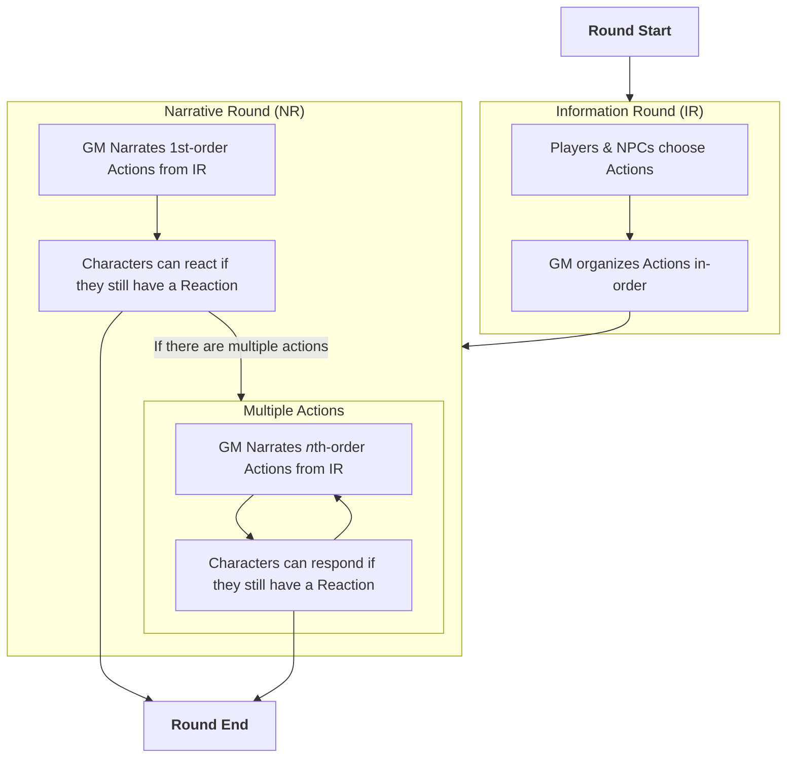

# Overview

Owner: a z, Justin

# Quick-Time Combat 0.2.4

While roleplaying and exploring, players may come into combat situations. These are the rules to Quick Time Combat, how to prepare and execute.

Pre-considerations are ensuring you have information and knowledge of characters' abilities, equipment and stats beforehand

# Structure of a QTC Round

# Attributes:

### Reflex

- Base Value of 10
- Adds Dexterity Modifier [Negative Applies]
- Add Wearable Modifier
- Add Other Modifiers granted by Class Abilities or Magical Equipment
- 2 for each point of **Exhaustion**

### Armor

- Starts from 0
- Add Wearable Modifier
- Add Shield Modifier
- Add Racial Bonus, if any
- Add Other Modifiers granted by Class Abilities or Magical Equipment

### Movement

- Starts at 10ft
- Add Racial Bonus, if any
- Add Other Modifiers granted by Class Abilities or Magical Equipment

### **Attributes Distribution**

- [Points Buy](https://chicken-dinner.com/5e/5e-point-buy.html)
- 4d6

∙ Roll 4d6, subtract the lowest result

∙ Add Racial Bonuses

- JAISON WAY

∙ Base value of 6

∙ Add Racial Bonuses

∙ Roll 3d6, subtract the lowest result

# Equipment:

- Weapons
    - All weapons have a base damage dice [1d4 — 1d12] that adds your **Attack** modifier, which is by default Strength
    - Different Weapons have various tags that either grant them unique modifiers, added abilities or disadvantages [Refer to **Weapon Tags**]
    - Proficiency in Weapons allow using Proficiency Modifier on Attack
    - Expertise in Weapons Enable Parry
- Wearables
    - Basic clothing

∙ +0 to **Armor**

∙ +1 to Reflex

- Light Armor

∙ Starts at +1 to **Armo**r [Pro]

∙ +1 to Reflex [Expert]

- Medium Armor

∙ Starts at +2 to **Armor** [Pro]

**∙** -1 to **Reflex**

∙ Disadvantage on Stealth Checks [Disabled when Expert]

- Heavy Armor

∙ Starts at +3 to **Armor** [Pro]

∙ -2 to **Reflex**

∙ Disadvantage on Stealth Checks

∙ Disables Disengaging and Dashing [Normal when Expert]

- Armor can also be enchanted to have magical effects
- Shields
    - Improvised Shields

∙ Starts at +1 to Armor [+2 when Pro]

∙ Breaks upon Successful Attack [Breaks upon Crit when Expert]

∙ Enables **Parry** [Expert]

- Light Shields

∙ Starts at +2 to Armor [Pro]

∙ Enables **Parry**

∙ Adds a 1d6 to Parry [Expert]

- Heavy Shields

∙ +3 to Armor [Pro]

∙ Enables Parry [Expert]

- All Shields enable **Defend**

# Actions:

- Attack
    - Typically a 1d20 that adds your **Attack** modifier
    - To Hit:

∙ Result must surpass the target's Reflex

- To Crit:

∙ Result must be a Natural 20 on the dice roll

OR

∙ Result must be 10 higher than the target's **Reflex**

- Damage:

∙ Use weapon's damage dice added with **Attack** modifier, take note of weapon damage type

∙ Add any additional modifiers granted by Spells, Abilities or Effects, take note of weapon damage type

∙ Critical Damage simply adds the highest possible result of a single weapon Damage die to the Damage

- Move
    - Full Speed

∙ Typically 10ft unless increased by Class Ability, Consumables and/or Magical Equipment

- Half Speed

∙ Typically 5ft unless increased by Class Ability, Consumables and/or Magical Equipment

∙ Enables **Mobile Attack**

- Disengage

∙ Granted by Class Ability and/or Magical Equipment

∙ Consumes **Reaction** and does not incur **Attack of Opportunity** when Moving until the End of Narrative Round

- Dashing

∙ Granted by Class Ability and/or Magical Equipment

∙ Consumes **Reaction** to add Half of **Full Speed** to your Speed until the End of Narrative Round

- Defend
    - Doubles your **Armor** until the End of the Narrative Round
- Preparation
    - Casting a Simple Spell

∙ The spell is completed at the end of the Narrative Round

∙ Disrupted by Damage during Narrative Round

- Channelling

∙ Begin Consuming Actions in order to cast a **Ritual** Spell

- Assist

∙ Helping an Ally grants them Advantage their next Ability Check or Saving Throw

- Using an Item

∙ Changing Equipment consumes an Action

∙ Using a Consumable consumes an Action

- Focused Dodging/Parrying
    - Dodging

∙ Consuming an Action to Dodge inflicts **Disadvantage** on all incoming **Attacks**

- Parrying

∙ Consuming an Action to Parry increases **Armor** by a base weapon Crit for the next incoming **Attack**

- Instant Spellcasting
    - Cantrips

∙ Cantrips are cast at the start of the Narrative Round

∙ Increase in Power as you level

- Quickened Spells

∙ Weaker versions of Simple Spells

∙ Cast at the start of the Narrative Round

∙ Spells with Damage has its die halved [Rounded Up] before rolling

∙ Spells with Duration only lasts until the end of your next Action

∙ Spells that demand a Saving Throw, inflicts **Advantage** on the target's roll

- Quickened Spells consumes a Spell Slot when cast
- Cantrips, Prepared Simple Spells and Channelled Ritual Spells do not consume a Spell Slot when cast

# Reactions:

- Attack of Opportunity
    - A standard **Attack** that does not proc any "Attack Action" abilities
    - Typically, the target must be **Moving** regardless of Speed away from your position
    - Other Attack of Opportunities may be granted by Feats
- Dodge
    - Inflicts **Disadvantage** on the next incoming **Attack**
- Parry
    - Finesse Weapon

∙ Increases **Armor** by a base weapon damage dice for the next incoming **Attack**

- Light Shields

∙ Increases **Armor** by its own Armor value

- Casting a Reaction Spell
    - Consumes a Reaction to cast
    - Consumes a Spell Slot when cast

## **Spellcasting**

- Cantrips

∙ 1 Action

∙ Start of Narrative Round

∙ No Spell Slot used

∙ Cannot upcast

- Quickened

∙ 1 Action

∙ Start of Narrative Round

∙ Spell Slot used

∙ Cannot upcast

∙ No Ritual

∙ No Concentration

∙ No Dialogue

- Simple

∙ 1 Action

∙ End of Narrative Round

∙ No Spell Slot used

∙ Can Upcast

- Ritual

∙ More than 1 Action

∙ End of Narrative Round

∙ No Spell Slot used

∙ Can Upcast

- Reaction

∙ 1 Reaction

∙ During Narrative Round

∙ Spell Slot used

Unchanged QTC Custom/Changed Feats

Saturday, 16 December 2023

1:54 am

### Alert:

You gain a 2nd Reaction, you can't be surprised and creatures you don't see don't gain Advantage on Attack against you

### Charger:

You gain Dash, your speed increases by 5ft and your Heavy weapon can Mobile Attack

### Defensive Duelist:

Your Parry and Focused Parrying now applies to all incoming Attacks

### Dual Wielder:

You gain +2 to Reflex when wielding 2 Melee weapons and +2 to Attack if both are Light weapons

### Heavily Armored:

+1 in STR, and gain Proficiency in Heavy Armor, or Expertise if you are Proficient

### Heavy Armor Master:

+1 to STR and gain resistance to bludgeoning, slashing and piercing damage when wearing Heavy Armor

### Lightly Armored:

+1 to STR or DEX, and gain Proficiency in Light Armor, or Expertise if you are Proficient

### Light Armor Master:

+1 to STR or DEX, and +2 to Reflex when wearing Light Armor

### Moderately Armored:

+1 to STR or DEX, and gain Proficiency in Medium Armor, or Expertise if you are Proficient

### Medium Armor Master:

+1 to STR or DEX, no disadvantage to Reflex and Medium Armor counts as a +2 Light Shield

### Mobile:

Your speed increases by 5ft, you gain Dash and Disengage, and +2 to Mobile Attack

### Shield Master:

Gain Expertise with Shields, a Successful Shove Attacks inflict Prone on Medium or smaller Creatures and take no damage from successful Spell saving throws

### Tavern Brawler:

+1 to STR or CON, proficiency with Improvised Weapons and Shields, gain an additional Action when Unarmed and gain an additional Reaction when outnumbered
